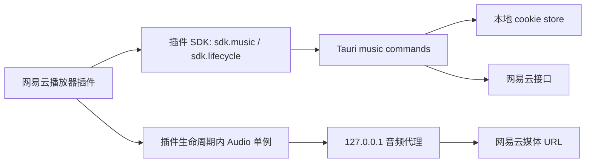

# 网易云播放器官方插件设计文档

> 创建日期：2026-08-04  
> 状态：Stage 1 设计草案，待批准  
> 前置调研：本轮 grill-me 访谈结论、当前 EasyGameHub 插件系统、NexBox 音乐播放器实现思路  
> 参考项目：`D:\apps\appss\ws\ets2\NexBox`，仅参考架构，不直接复制 GPLv3 代码

## 1. 背景与目标

EasyGameHub 已经有插件系统：插件可以注册侧边栏页面和设置区块，读取私有配置，并通过 `manifest.json`、`bundle.js`、`assets/*` 打包安装。现有 SDK 权限包括 `core.read`、`core.backup`、`events`、`ui`，还没有音乐能力、生命周期清理能力或媒体代理能力。

本设计交付一款“网易云播放器官方插件”。播放器作为官方内置插件随程序附带，但仍走插件系统启用、禁用、重载和卸载；宿主提供受控音乐 API，插件负责播放器 UI、队列、歌词和播放控制。

目标：

- 支持网易云账号正常登录，不做破解、不绕过版权和 VIP 权限。
- 支持账号权限范围内的正常播放。
- 支持试听片段播放，并在 UI 中明确标记。
- 支持搜索、我的歌单、歌单歌曲、播放队列、音量、进度、普通 LRC 歌词和翻译歌词。
- 播放状态在插件启用期间全局存在，路由切换不停止；插件禁用、卸载、重载时停止并清理。
- 不做宿主迷你播放器。离开插件页面后音乐继续，控制播放需要回到插件页面。

## 2. 范围定义

### 2.1 第一版纳入范围

| 能力 | 说明 |
| --- | --- |
| 官方插件分发 | 内置 `com.easygamehub.netease-music` 插件，仍走插件系统加载 |
| 插件生命周期清理 | 新增 `teardown()` 或 `sdk.lifecycle.onDispose()`，卸载时停止音频并释放监听器 |
| 音乐权限 | manifest 新增 `music` 权限；未声明时调用 `sdk.music.*` 抛出 `PermissionDenied` |
| 宿主网易云后端 | Rust/Tauri 命令提供登录、搜索、歌单、歌曲 URL、歌词、音频代理 |
| 登录 | 打开网易云官方登录窗口，宿主读取 WebView cookie，保存到本地 store |
| 账号状态 | 插件显示头像、昵称、VIP/SVIP 状态、登录/登出 |
| 搜索 | 支持歌曲搜索，MVP 不做歌单/歌手搜索 |
| 我的歌单 | 登录后读取用户歌单，支持选择歌单并加载歌曲 |
| 播放 | HTMLAudioElement 播放，经宿主本地音频代理处理 Range/CORS |
| 队列 | 播放队列、上一首、下一首、列表循环、单曲循环、随机播放 |
| 试听 | 后端返回试听 URL 时允许播放，UI 标记“试听片段” |
| 歌词 | 普通 LRC 解析、翻译歌词、当前行高亮、自动滚动 |
| UI | 三栏播放器：左侧歌单，中间搜索/歌曲列表，右侧播放控制、歌词和队列 |

### 2.2 第一版不纳入范围

- 破解、灰歌解锁、VIP 绕过、替代音源搜索。
- 喜欢/取消喜欢、收藏/取消收藏歌单、评论、点赞、关注等账号写操作。
- 每日推荐、私人 FM、MV、电台、云盘、下载、本地缓存。
- 桌面歌词、逐字歌词、卡拉 OK 高亮、歌词窗口锁定。
- 宿主迷你播放器、全局快捷键、系统媒体控制集成。
- 外部自建 `NeteaseCloudMusicApi` 服务依赖。
- 直接迁移 NexBox 源码。

## 3. 关键设计决策

### 3.1 官方插件，而不是主程序内置页面

采用“官方内置插件”方案。宿主扩展通用 `music` SDK，网易云播放器作为插件注册页面。这样可以验证插件系统承载复杂业务的能力，同时避免把网易云播放器写死进主程序。

插件目录建议：

```text
plugins/com.easygamehub.netease-music/
  manifest.json
  bundle.js
  config.json
  assets/
```

### 3.2 参考 NexBox，但重写实现

NexBox 已证明“Rust 网易云 API + cookie store + WebView 登录窗口 + 本地音频代理 + 前端 Audio 播放状态”的路线可行。本项目只参考架构，不复制实现代码，避免 GPLv3 代码迁移造成许可影响。

可参考的设计点：

- Rust 侧集中处理网易云请求和 cookie。
- WebView 登录窗口可读取 HttpOnly cookie，插件页面不直接接触 `MUSIC_U`。
- 本地 `127.0.0.1:<port>/audio?url=...` 代理支持 Range 请求和流式传输。
- 前端播放器状态脱离页面组件，以便路由切换后继续播放。

### 3.3 合规边界

播放逻辑只使用当前账号可获得的播放 URL。后端不尝试绕过版权限制，不找替代源，不修改播放权限。歌曲不可播放时向插件返回结构化原因，由插件提示用户。

试听片段属于接口返回的可播放内容，允许播放，但 UI 必须明确标识。

## 4. 总体架构



分层职责：

- 宿主 Rust：网易云接口、登录窗口、cookie 存储、播放 URL、歌词、音频和封面代理。
- 插件 SDK：权限校验、类型化封装、生命周期清理入口。
- 插件 runtime：Audio 单例、播放队列、当前歌曲、音量、模式、歌词解析状态。
- 插件页面：三栏 UI、交互控制、状态订阅和渲染。

## 5. Rust 后端设计

### 5.1 模块布局

```text
src-tauri/src/core/music/
  mod.rs
  models.rs
  cookie.rs
  netease.rs
  proxy.rs
  login.rs

src-tauri/src/commands/music.rs
```

`core/music` 放业务逻辑和 HTTP 请求；`commands/music.rs` 只做 Tauri 参数接收和错误映射。

### 5.2 依赖

`src-tauri/Cargo.toml` 需要补充：

- `reqwest`：网易云 HTTP 请求、音频代理上游请求。
- `axum`：本地音频和封面代理服务。
- `futures-util`：音频代理流式 body。
- `tauri-plugin-store`：保存网易云 cookie。
- `url`、`urlencoding`：URL 解析和参数编码。

第一版使用官方登录窗口，不实现二维码 EAPI，因此不需要先引入 AES/EAPI 加密相关依赖。

### 5.3 数据模型

后端暴露统一结构：

```text
Song { provider, id, name, artist, artists, album, cover, duration, fee, playable, language }
Playlist { provider, id, name, cover, track_count, creator, subscribed }
SongUrlResult { url, playable, trial, level, quality, br, reason, message, fee }
LoginInfo { provider, logged_in, user_id, nickname, avatar, vip_type, vip_level, is_vip, is_svip }
Lyrics { lyric, translation }
```

### 5.4 命令清单

| 命令 | 说明 |
| --- | --- |
| `music_open_login_window` | 打开网易云官方登录窗口并轮询 cookie |
| `music_login_status` | 读取本地 cookie 并校验登录状态 |
| `music_logout` | 清除本地网易云 cookie |
| `music_search` | 搜索歌曲 |
| `music_user_playlists` | 读取当前用户歌单 |
| `music_playlist_tracks` | 读取歌单首批歌曲 |
| `music_playlist_tracks_range` | 分页读取歌单歌曲 |
| `music_song_url` | 获取歌曲播放 URL，支持音质降级和试听标记 |
| `music_lyric` | 获取 LRC 和翻译歌词 |
| `music_proxy_port` | 获取或启动本地音频/封面代理端口 |

### 5.5 登录流程

1. 插件调用 `sdk.music.openLoginWindow()`。
2. 宿主创建或刷新 `netease-login` WebView，导航到 `https://music.163.com/#/login`。
3. 用户在官方页面完成登录。
4. 宿主轮询该窗口 cookies。
5. 发现 `MUSIC_U` 后，过滤网易云域名 cookie 并规范化。
6. cookie 保存到 `music-cookies.json`。
7. 宿主关闭登录窗口，emit `music:login-success`。
8. 插件刷新账号状态、歌单和播放能力。

插件页面不接收原始 cookie。

### 5.6 音频和封面代理

本地代理绑定 `127.0.0.1:0` 随机端口，首次调用 `music_proxy_port` 时启动，重复调用返回既有端口。

```text
GET /audio?url=<encoded-media-url>
GET /cover?url=<encoded-cover-url>
```

代理行为：

- 只允许 `http://` 和 `https://` URL。
- 转发 `Range` 请求，保留 `Content-Length`、`Content-Range`。
- 输出 `Access-Control-Allow-Origin: *` 和 `Accept-Ranges: bytes`。
- 音频使用流式传输，不整体读入内存。
- 封面响应增加跨域资源策略和缓存头。

## 6. SDK 设计

### 6.1 权限

`src/plugins/sdk.ts` 和 Rust `KNOWN_PERMISSIONS` 新增 `music`。

manifest 示例：

```json
{
  "id": "com.easygamehub.netease-music",
  "name": "网易云播放器",
  "version": "0.1.0",
  "api_version": 1,
  "entry": "bundle.js",
  "permissions": ["ui", "music"]
}
```

### 6.2 `sdk.music`

```ts
sdk.music.openLoginWindow(): Promise<void>
sdk.music.loginStatus(): Promise<LoginInfo>
sdk.music.logout(): Promise<void>
sdk.music.search(keywords: string, limit?: number): Promise<Song[]>
sdk.music.userPlaylists(): Promise<Playlist[]>
sdk.music.playlistTracks(id: string): Promise<[Playlist, Song[]]>
sdk.music.playlistTracksRange(id: string, start: number, count: number): Promise<Song[]>
sdk.music.songUrl(id: string, quality?: PlaybackQuality): Promise<SongUrlResult>
sdk.music.lyric(id: string): Promise<Lyrics>
sdk.music.proxyPort(): Promise<number>
sdk.music.audioProxyUrl(rawUrl: string): Promise<string>
sdk.music.coverProxyUrl(rawUrl: string): Promise<string>
```

所有方法调用前执行 `requirePerm("music", apiName)`。

### 6.3 生命周期

优先实现：

```ts
sdk.lifecycle.onDispose(() => {
  audio.pause();
  audio.src = "";
  cleanupListeners();
});
```

同时兼容模块导出：

```ts
export function teardown() {
  runtime.dispose();
}
```

卸载顺序：

1. 调用 SDK 注册的 dispose callbacks。
2. 调用模块导出的 `teardown()`。
3. 清除页面、设置区块和事件监听。
4. 从 loaded map 移除插件。

## 7. 插件运行时设计

网易云插件在模块级创建 runtime，页面组件只订阅 runtime。

核心状态：

- `currentSong`
- `isPlaying`
- `currentTime`
- `duration`
- `volume`
- `playMode`: `list | shuffle | one`
- `queue`
- `currentIndex`
- `loginInfo`
- `userPlaylists`
- `activePlaylist`
- `activeTracks`
- `searchResults`
- `lyrics`
- `trial`
- `loading` 和 `error`

核心动作：

- `init()`
- `openLoginWindow()`
- `logout()`
- `search(keywords)`
- `loadUserPlaylists()`
- `loadPlaylist(id)`
- `playSong(song, queue?)`
- `togglePlay()`
- `nextTrack()`
- `prevTrack()`
- `seek(time)`
- `setVolume(value)`
- `setPlayMode(mode)`
- `loadLyrics(songId)`
- `dispose()`

持久化：

- 音量、播放模式、最近音质可写入 `sdk.storage`。
- 当前队列 MVP 不持久化，避免启动后播放 URL 过期造成异常。

## 8. 播放行为

`playSong` 流程：

1. 递增播放序列号，避免旧请求覆盖新请求。
2. 调用 `sdk.music.songUrl(song.id, quality)`。
3. `playable && url` 时，经 `sdk.music.audioProxyUrl(url)` 设置到 `audio.src`。
4. `trial === true` 时设置当前歌曲试听状态并显示标记。
5. 播放失败时尝试重新获取一次 URL；仍失败则提示并停止或跳过。
6. 异步加载歌词，不阻塞播放。

不可播放规则：

- 手动点播完全无 URL：toast 提示，不改变当前歌曲。
- 队列自动播放完全无 URL：提示并跳到下一首。
- 连续 5 首完全不可播放：停止自动跳过，提示队列中多首歌曲不可播放。
- 试听片段按普通队列项播放，播完正常进入下一首。

生命周期规则：

- 路由切换：不停止播放。
- 插件禁用：停止播放、清空 audio、移除事件监听。
- 插件重载：先 unload 旧 runtime，再 load 新 runtime。
- 插件卸载：同禁用，并删除插件目录。

## 9. UI 设计

第一版采用三栏播放器，跟随 EasyGameHub 主题变量和现有玻璃组件风格，不大面积使用网易云红色。

- 左栏：登录状态、登录/登出按钮、我的歌单。
- 中栏：搜索框、搜索结果、当前歌单歌曲列表。
- 右栏：封面、歌名、歌手、试听标记、播放控制、进度、音量、歌词、队列。

窄宽度下三栏折叠为纵向分区，歌单和队列使用可滚动区域。

歌词只做普通 LRC：

- 解析 `[mm:ss.xx]`。
- 翻译歌词按时间戳合并到原文行下方。
- 当前行高亮并自动滚动。
- 无歌词显示空态。

## 10. 内置插件分发

推荐新增官方插件源码目录：

```text
scripts/official-plugins/netease-music/
  package.json
  manifest.json
  tsconfig.json
  src/
    index.tsx
    runtime.ts
    types.ts
    lyrics.ts
    styles.ts
```

构建产物：

```text
plugins/com.easygamehub.netease-music/
  manifest.json
  bundle.js
```

可选默认资源目录：

```text
resources/defaults/plugins/com.easygamehub.netease-music/
  manifest.json
  bundle.js
```

启动同步策略：

- 如果 `plugins/com.easygamehub.netease-music` 不存在，则从 defaults 复制。
- 如果 registry 中用户已禁用该插件，不重新启用。
- 如果 defaults 版本高于已安装版本，可覆盖 bundle 和 manifest，但保留 `config.json`。

## 11. 验证策略

Rust：

```powershell
cd src-tauri
cargo test music
cargo check
```

前端：

```powershell
npm run build
```

集成：

- 启动 Tauri dev。
- 启用网易云插件。
- 打开登录窗口，完成网易云官方登录。
- 验证登录状态、我的歌单、搜索、播放、试听标记、歌词滚动。
- 切到其他 EasyGameHub 页面，确认音乐继续播放。
- 禁用或重载插件，确认音乐停止且无残留监听器。

## 12. 风险与回退

| 风险 | 应对 |
| --- | --- |
| 网易云接口变化 | 后端集中封装，错误结构化返回；插件只显示提示 |
| 登录窗口 cookie 读取失败 | 保留手动刷新登录窗口；后续再补二维码登录 |
| 音频 URL 防盗链或跨域 | 使用本地代理，带 User-Agent 和 Referer |
| 长音频中途超时 | 音频代理使用流式客户端，不设置整体读取超时 |
| 插件路由切换导致播放停止 | Audio 单例放在插件 runtime，不放页面组件 |
| 插件禁用后仍播放 | lifecycle dispose 强制 pause、清空 src、移除监听器 |
| NexBox GPLv3 许可影响 | 只参考设计，不复制源代码；关键实现按本项目重写 |
| `music` 权限过大 | 第一版仅开放只读和播放相关接口，不开放账号写操作 |

## 13. 验收标准

- 插件管理器中可看到“网易云播放器”官方插件，可启用、禁用、重载。
- 插件启用后侧边栏出现播放器入口。
- 官方登录窗口可完成登录，插件显示账号信息。
- 搜索歌曲可返回结果并播放账号可用歌曲。
- 我的歌单可加载，点击歌曲可进入队列播放。
- 试听片段可播放，并标记为“试听片段”。
- 普通歌词和翻译歌词可随播放时间高亮滚动。
- 切换到非插件页面后音乐继续播放。
- 禁用、卸载或重载插件时音乐停止。
- 不可播放歌曲不触发破解逻辑，不查找替代源。
