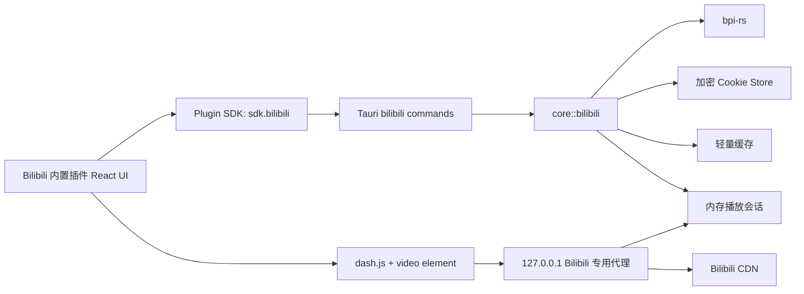

# Bilibili 内置视频插件设计文档

> 创建日期：2026-08-10  
> 状态：Stage 1 设计草案，待批准  
> 工作流：`programming-workflow` Stage 1 Requirement Exploration  
> 参考项目：`D:\apps\appss\ws\ets2\wiliwili`、`D:\apps\appss\ws\ets2\EasyGameHub\bpi-rs`  
> 许可策略：`wiliwili` 仅作为产品能力和接口行为参考，不复制 C++/XML 源码；Bilibili API 能力优先通过本仓库内 `bpi-rs` Rust SDK 接入

## 1. 背景与目标

EasyGameHub 现有插件系统已经支持官方内置插件分发、侧边栏页面注册、设置区块、私有配置和权限裁剪 SDK。当前官方网易云插件证明了“宿主 Rust 后端能力 + 本地代理 + 插件 React UI”的路线可以承载复杂媒体功能。

本设计交付一款 Bilibili 官方内置插件。插件不是独立第三方 zip 小插件，而是随 EasyGameHub 分发的内置插件；宿主可以安全地扩展专用 Bilibili SDK、Tauri commands、本地播放代理和加密账号存储。插件负责视频客户端 UI、DASH 播放、弹幕渲染、评论交互、首页与播放页导航。

目标：

- 在 EasyGameHub 内提供 Bilibili 普通投稿视频的内置播放体验。
- 首页和播放页分离，信息结构参考 `wiliwili`，视觉语言遵循 EasyGameHub。
- 支持二维码登录、登录状态、退出登录和 Cookie 加密保存。
- 支持搜索、热门/排行榜、历史记录、稍后再看、收藏夹浏览。
- 支持普通视频详情、分 P、DASH 播放、自动清晰度、播放中清晰度切换。
- 支持滚动弹幕显示、弹幕设置、普通文本弹幕发送。
- 支持评论读取、发布、回复、点赞、点踩、删除、置顶、举报。
- 支持写回 B 站观看进度/历史，并读取 B 站进度用于续播。
- 支持截图保存、外部浏览器打开和结构化错误提示。

## 2. 范围定义

### 2.1 第一版纳入范围

| 能力 | 说明 |
| --- | --- |
| 官方内置插件 | 新增 `com.easygamehub.bilibili`，随应用 defaults 分发，仍走插件系统启用、禁用、重载 |
| 插件 SDK 权限 | 新增 `bilibili` 权限，插件通过 `sdk.bilibili.*` 访问宿主能力 |
| Rust 后端 | `src-tauri/src/core/bilibili` 接入 `bpi-rs`，封装账号、视频、取流、评论、弹幕、历史、收藏、稍后再看 |
| 专用媒体代理 | 本地 `127.0.0.1` 专用代理，只代理宿主签发的 B 站播放会话 URL |
| 首页 | 搜索、热门/排行榜、历史记录、稍后再看、收藏夹入口 |
| 播放页 | DASH 播放器、分 P、清晰度、弹幕、评论、视频信息、外部打开 |
| 登录 | 二维码登录、登录状态、退出登录、Cookie 加密保存 |
| 播放 | 普通投稿视频 BV/AV，DASH 播放，默认 ABR 自动清晰度 |
| 清晰度切换 | 使用 `dash.js` 在播放中切换 video representation；手动选择后锁定清晰度，自动模式交给 ABR |
| 弹幕显示 | 当前分 P 普通滚动弹幕、开关、字号、透明度、密度/速度、seek 同步 |
| 弹幕发送 | 登录后发送普通文本弹幕，成功后临时插入当前时间轴 |
| 评论 | 读取、分页、楼中楼、发布、回复、点赞、点踩、删除、置顶、举报 |
| 账号内容 | 历史记录、稍后再看、收藏夹浏览；当前视频收藏/取消收藏、稍后再看添加/移除 |
| 进度同步 | 节流写回 B 站观看进度；打开播放页读取 B 站进度续播，本地进度兜底 |
| 截图 | 保存当前帧；默认纯视频帧，可选包含弹幕；保存到插件自有目录 |
| 快捷键 | Space、方向键、M、F、D、Esc；输入框聚焦时禁用 |
| 倍速 | 0.5x、0.75x、1x、1.25x、1.5x、2x |
| 轻量缓存 | 封面、首页列表、搜索结果、收藏夹、历史、视频详情；播放 URL 只进内存会话 |

### 2.2 第一版不纳入范围

- 番剧、影视、课程、直播播放。
- 视频下载、离线缓存、音视频合并、批量下载。
- 高级弹幕、彩色弹幕、复杂位置/字体弹幕、历史弹幕日期选择。
- 动态、关注 UP、私信、创作中心、钱包、大会员中心。
- 清空历史、清空稍后再看、批量删除收藏夹内容、移动收藏夹资源、删除收藏夹。
- 绕过登录、会员、版权、地区限制或风控。
- 把 B 站截图混入 EasyGameHub 游戏截图库。

## 3. 已确认设计决策

### 3.1 内置插件直接打通宿主 SDK 和代理

Bilibili 插件作为官方内置插件实现，不受第三方插件只能使用通用 SDK 的限制。宿主扩展 `bilibili` 权限和专用 commands，插件只调用受控的 `sdk.bilibili.*`。

这样可以解决以下问题：

- 浏览器 `fetch` 直连 B 站 API 的 CORS 问题。
- Cookie、CSRF、WBI 签名和登录态安全边界。
- 媒体 URL 防盗链、Range、Referer、CORS、播放 URL 过期问题。
- 账号副作用操作的权限收敛和错误分类。

### 3.2 首页和播放页分离

页面结构参考 `wiliwili` 的视频客户端习惯，不把搜索、详情、播放器和账号内容塞在同一个控制台中。

建议插件路由：

```text
/plugin/com.easygamehub.bilibili/home
/plugin/com.easygamehub.bilibili/watch?bvid=BVxxxx&cid=123
```

播放页可通过查询参数恢复视频。插件 storage 保存最近一次播放和最近观看列表，作为首页恢复入口。

### 3.3 普通投稿视频优先

第一版只支持普通投稿视频。普通视频已经覆盖完整主链路：搜索、详情、分 P、取流、DASH、弹幕、评论、历史写回。番剧/影视/课程/直播保留为后续独立阶段，因为模型、权限和流协议不同。

### 3.4 使用 `dash.js` 承载 DASH 播放

B 站取流常见为 DASH 音视频分离。第一版允许在官方内置插件中引入 `dash.js`，由其处理 MSE、缓冲、seek、ABR 和 representation 切换。

播放策略：

- 默认启用 ABR 自动清晰度。
- UI 提供 `自动` 和具体清晰度选项。
- 用户选择具体清晰度后，关闭 video ABR 并锁定目标 representation。
- 用户切回 `自动` 后恢复 ABR。
- 开启 fast switch，使升档尽量贴近当前播放点。
- 不承诺浏览器层面的“零延迟瞬切”，但不重建播放器、不清空播放进度。

### 3.5 写回 B 站观看进度

第一版写回观看进度和历史。`bpi-rs` 已有 `video.report_watch_progress`，接口位于 `https://api.bilibili.com/x/v2/history/report`。

规则：

- 登录后默认启用。
- 设置区提供 `同步观看进度到 B 站` 开关。
- 播放中每 15-30 秒节流上报。
- 暂停、切 P、退出播放页、播放结束时补一次上报。
- seek 后等待稳定播放数秒再上报。
- 上报失败不打断播放，只显示轻提示。
- 本地进度始终保存，用于网络失败或未登录时续播。
- 打开播放页优先使用 B 站返回的 `last_play_time` / `last_play_cid`，本地进度作为备用。

### 3.6 评论和弹幕允许账号写操作

第一版支持评论读写和普通文本弹幕发送。这些操作均要求登录态和 CSRF。UI 必须降低误触风险：

- 发评论/回复失败时保留输入。
- 点赞/点踩失败时回滚前端乐观状态。
- 删除评论必须确认。
- 举报评论必须选择原因并二次确认。
- 置顶仅在后端或接口允许时显示，权限不足时结构化提示。
- 弹幕发送按钮有 3-5 秒冷却，避免连发触发风控。

## 4. 总体架构



分层职责：

- `bpi-rs`：提供 Bilibili API 类型化访问、WBI、Cookie、错误分类基础。
- `core::bilibili`：组合 SDK 能力，适配 EasyGameHub 数据模型、缓存、代理会话、账号存储。
- `commands::bilibili`：Tauri 边界，做参数 DTO、错误 DTO、`Result<T, String>` 映射。
- `src/plugins/sdk.ts`：权限校验和前端 SDK 封装。
- 官方插件：页面、播放器、状态管理、弹幕 overlay、评论交互、快捷键。
- 本地代理：只代理当前播放会话登记过的 CDN URL，不暴露任意 URL 代理。

## 5. Rust 后端设计

### 5.1 模块布局

```text
src-tauri/src/core/bilibili/
  mod.rs
  account.rs
  client.rs
  models.rs
  video.rs
  playback.rs
  proxy.rs
  danmaku.rs
  comment.rs
  library.rs
  cache.rs
  errors.rs

src-tauri/src/commands/bilibili.rs
```

职责说明：

- `account.rs`：二维码登录、Cookie 加密存储、登录状态、退出登录。
- `client.rs`：从当前账号构建 `BpiClient`，统一携带 Cookie、User-Agent 和错误转换。
- `video.rs`：搜索、热门/排行榜、视频详情、分 P、相关推荐。
- `playback.rs`：取流、DASH source DTO、播放会话创建、清晰度和 track 映射。
- `proxy.rs`：本地媒体/封面代理。
- `danmaku.rs`：弹幕读取、普通文本弹幕发送。
- `comment.rs`：评论读取和写操作。
- `library.rs`：历史记录、稍后再看、收藏夹。
- `cache.rs`：轻量缓存、封面缓存、缓存清理。
- `errors.rs`：统一错误分类。

### 5.2 依赖

`src-tauri/Cargo.toml` 建议新增或确认：

```toml
bpi-rs = { path = "../bpi-rs", default-features = false, features = [
  "login",
  "video",
  "video_ranking",
  "search",
  "danmaku",
  "comment",
  "historytoview",
  "fav",
  "user",
] }
```

注意事项：

- `bpi-rs` 当前 `edition = "2024"`、`rust-version = "1.85"`。接入前需确认本地 Rust toolchain 满足要求。
- 如果构建体积或编译时间压力明显，可按实际接口继续收缩 features。
- `src-tauri` 已有 `reqwest`、`axum`、`tokio`、`url`、`urlencoding` 等依赖，Bilibili 代理可复用现有模式。
- 前端官方插件新增 `dashjs` 依赖，打包进内置插件 bundle。

### 5.3 后端 DTO

后端不要把 `bpi-rs` 原始模型直接暴露给插件，避免前端被外部响应结构绑死。建议输出稳定 DTO：

```text
BiliLoginInfo
BiliQrLoginKey
BiliQrLoginStatus
BiliVideoCard
BiliVideoDetail
BiliVideoPage
BiliPlaybackSource
BiliPlaybackTrack
BiliQualityOption
BiliDanmakuItem
BiliComment
BiliCommentPage
BiliHistoryItem
BiliToViewItem
BiliFavoriteFolder
BiliFavoriteItem
BiliOperationResult
BiliErrorDto
```

`BiliErrorDto` 至少包含：

```text
kind: "notLoggedIn" | "loginExpired" | "vipRequired" | "permissionDenied" |
      "regionRestricted" | "copyrightRestricted" | "riskControl" |
      "network" | "proxy" | "playback" | "api" | "unknown"
message: string
retryable: boolean
externalUrl?: string
```

### 5.4 Tauri command 清单

账号：

| 命令 | 说明 |
| --- | --- |
| `bilibili_login_qr_key` | 创建二维码登录 key 和 URL |
| `bilibili_login_qr_check` | 轮询二维码登录状态，成功后保存 Cookie |
| `bilibili_login_status` | 返回当前登录状态 |
| `bilibili_logout` | 清理 Bilibili Cookie |

首页和视频：

| 命令 | 说明 |
| --- | --- |
| `bilibili_search_videos` | 搜索普通视频 |
| `bilibili_popular_videos` | 热门/排行榜列表 |
| `bilibili_video_detail` | 视频详情、分 P、统计、UP 主信息、续播信息 |
| `bilibili_related_videos` | 相关推荐 |

播放：

| 命令 | 说明 |
| --- | --- |
| `bilibili_create_playback` | 取流并创建内存播放会话 |
| `bilibili_playback_manifest` | 返回 dash.js 可加载的 MPD URL 或 source 描述 |
| `bilibili_report_progress` | 写回观看进度 |
| `bilibili_save_local_progress` | 保存本地进度 |
| `bilibili_capture_frame` | 保存截图 fallback；优先前端 canvas 截图 |

弹幕：

| 命令 | 说明 |
| --- | --- |
| `bilibili_danmaku_list` | 当前分 P 弹幕 |
| `bilibili_send_danmaku` | 发送普通文本弹幕 |

评论：

| 命令 | 说明 |
| --- | --- |
| `bilibili_comment_list` | 评论列表 |
| `bilibili_comment_replies` | 楼中楼 |
| `bilibili_comment_add` | 发布评论/回复 |
| `bilibili_comment_like` | 点赞/取消点赞 |
| `bilibili_comment_dislike` | 点踩/取消点踩 |
| `bilibili_comment_delete` | 删除评论 |
| `bilibili_comment_top` | 置顶/取消置顶 |
| `bilibili_comment_report` | 举报评论 |

账号内容：

| 命令 | 说明 |
| --- | --- |
| `bilibili_history_list` | 历史记录 |
| `bilibili_toview_list` | 稍后再看 |
| `bilibili_toview_add` | 添加稍后再看 |
| `bilibili_toview_remove` | 移除稍后再看 |
| `bilibili_favorite_folders` | 用户收藏夹列表 |
| `bilibili_favorite_items` | 收藏夹资源 |
| `bilibili_favorite_video` | 收藏/取消收藏当前视频 |

缓存和代理：

| 命令 | 说明 |
| --- | --- |
| `bilibili_proxy_port` | 获取或启动 Bilibili 专用代理端口 |
| `bilibili_clear_cache` | 清理封面和轻量缓存 |
| `bilibili_open_screenshot_folder` | 打开插件截图目录 |

## 6. 播放代理设计

### 6.1 专用会话代理

不采用 `?url=` 任意 URL 代理。Rust 侧取流后创建短期内存会话：

```text
PlaybackSession {
  playback_id,
  bvid,
  aid,
  cid,
  created_at,
  expires_at,
  tracks: HashMap<track_id, RemoteTrack>
}

RemoteTrack {
  track_id,
  kind: "video" | "audio",
  quality,
  codecs,
  mime_type,
  base_url,
  backup_urls,
  size,
}
```

代理路径：

```text
GET /bilibili/media/:playbackId/:trackId
GET /bilibili/cover/:cacheKey
GET /bilibili/dash/:playbackId/manifest.mpd
```

规则：

- 只允许访问内存会话登记过的 B 站 CDN URL。
- 会话默认 2 小时过期，切换视频或清理缓存时可主动移除。
- 转发 `Range`、`User-Agent`、`Referer: https://www.bilibili.com/`。
- 输出 `Access-Control-Allow-Origin: *`、`Accept-Ranges: bytes`、正确 `Content-Type`。
- 上游失败时按 backup URL 顺序重试。
- 原始播放 URL 不写入磁盘，不暴露到日志。

### 6.2 DASH manifest 方案

推荐 Rust 侧根据 `bpi-rs` 返回的 DASH tracks 生成临时 MPD，MPD 内 URL 指向本地代理 track URL。插件侧 `dash.js` 加载本地 MPD。

优势：

- dash.js 可原生管理音视频分离和 representation。
- 原始 CDN URL 不暴露给插件。
- 清晰度选项可与 MPD representation 对齐。
- 后续扩展字幕、音轨和更多媒体策略更自然。

## 7. 插件 SDK 设计

### 7.1 权限

新增权限：

```ts
type PluginPermission =
  | "core.read"
  | "core.backup"
  | "events"
  | "ui"
  | "music"
  | "bilibili";
```

Rust `KNOWN_PERMISSIONS` 同步增加 `"bilibili"`。

manifest 示例：

```json
{
  "id": "com.easygamehub.bilibili",
  "name": "Bilibili",
  "version": "0.1.0",
  "api_version": 1,
  "entry": "bundle.js",
  "permissions": ["ui", "bilibili"],
  "icon": "assets/bilibili.png",
  "description": "内置 Bilibili 视频播放插件"
}
```

### 7.2 `sdk.bilibili`

`sdk.bilibili` 应按能力分组：

```ts
sdk.bilibili.account.*
sdk.bilibili.home.*
sdk.bilibili.video.*
sdk.bilibili.playback.*
sdk.bilibili.danmaku.*
sdk.bilibili.comment.*
sdk.bilibili.library.*
sdk.bilibili.cache.*
```

所有方法进入前执行：

```ts
requirePerm("bilibili", "bilibili.<method>");
```

### 7.3 生命周期

插件必须注册清理逻辑：

```ts
sdk.lifecycle.onDispose(() => {
  runtime.dispose();
});
```

清理内容：

- 销毁 `dash.js` player。
- 暂停并清空 video element。
- 停止进度上报计时器。
- 停止弹幕动画循环。
- 移除全屏、键盘、播放器事件监听。
- 清理页面级 request token，避免旧响应覆盖新视频。

## 8. 插件前端设计

### 8.1 目录布局

```text
scripts/official-plugins/bilibili/
  package.json
  manifest.json
  tsconfig.json
  scripts/
    pack.mjs
  src/
    index.tsx
    runtime.ts
    sdk.d.ts
    types.ts
    routes.ts
    styles.ts
    pages/
      HomePage.tsx
      WatchPage.tsx
    components/
      LoginPanel.tsx
      VideoCard.tsx
      PlayerShell.tsx
      QualityMenu.tsx
      DanmakuOverlay.tsx
      DanmakuInput.tsx
      CommentPanel.tsx
      AccountLibraryTabs.tsx
      ScreenshotButton.tsx
    player/
      dashPlayer.ts
      keyboard.ts
      progressReporter.ts
      frameCapture.ts
    danmaku/
      layout.ts
      renderer.ts
      parser.ts
```

### 8.2 路由

插件注册两个页面：

```ts
sdk.ui.registerPage({
  path: "home",
  title: "Bilibili",
  icon: "video",
  render: HomePage,
});

sdk.ui.registerPage({
  path: "watch",
  title: "播放",
  icon: "playFilled",
  render: WatchPage,
});
```

首页点击视频后导航到：

```text
/plugin/com.easygamehub.bilibili/watch?bvid=BVxxx&cid=123
```

如果未传 `cid`，播放页加载详情后选择：

- B 站续播返回的 `last_play_cid`；
- 本地最近进度的 `cid`；
- 第一分 P。

### 8.3 首页

首页布局：

- 顶部：搜索框、登录状态、刷新按钮、外部打开 B 站。
- 主体 Tab：热门/排行榜、搜索结果、历史记录、稍后再看、收藏夹。
- 视频卡片：封面、标题、UP 主、播放量、弹幕数、时长、历史进度。
- 收藏夹：左侧收藏夹列表，右侧资源列表。
- 空态：未登录、无历史、无稍后再看、收藏夹为空分别提示。
- 点击视频卡片进入播放页。

默认内容：

- 未搜索时展示热门/排行榜。
- 搜索后切到搜索结果。
- 登录后账号内容 Tab 可用。

### 8.4 播放页

播放页布局：

- 主区域：播放器和弹幕 overlay。
- 播放器下方：弹幕输入条、视频标题、UP 主、统计信息、简介。
- 侧栏：分 P 列表、清晰度、倍速、弹幕设置、当前视频操作。
- 下方 Tab：评论、相关推荐。

视频操作：

- 收藏/取消收藏。
- 添加/移除稍后再看。
- 保存截图。
- 外部浏览器打开。
- 清理当前视频本地进度。

离开播放页：

- 默认暂停播放。
- 写回一次进度。
- 保存本地进度。
- 销毁 dash player 和弹幕渲染循环。

第一版不做全局悬浮播放器。

## 9. 播放器行为

### 9.1 初始化

1. 解析路由参数 `bvid` / `aid` / `cid`。
2. 加载视频详情。
3. 根据 B 站续播和本地进度确定初始 `cid` 和 `startTime`。
4. 调用 `bilibili_create_playback` 创建播放会话。
5. 获取本地 MPD URL。
6. 初始化 `dash.js` 并 attach 到 video element。
7. 初始化清晰度菜单和 ABR 状态。
8. 拉取当前分 P 弹幕和评论首屏。
9. 开始播放进度本地保存和 B 站写回节流。

### 9.2 清晰度切换

状态：

```text
qualityMode: "auto" | "manual"
selectedRepresentationId?: string
availableQualities: BiliQualityOption[]
```

行为：

- 默认 `auto`。
- 用户选择具体清晰度时，关闭 video auto switch，并设置目标 representation。
- 用户选择 `自动` 时，恢复 video auto switch。
- UI 显示当前实际 representation 和目标选择。
- 切换失败时回滚 UI 并提示。

### 9.3 快捷键

| 快捷键 | 行为 |
| --- | --- |
| `Space` | 播放/暂停 |
| `← / →` | 后退/前进 5 秒 |
| `↑ / ↓` | 音量增减 |
| `M` | 静音 |
| `F` | 网页内全屏播放器 |
| `D` | 弹幕开关 |
| `Esc` | 退出网页内全屏 |

输入框、评论框、弹幕框聚焦时禁用快捷键。

### 9.4 倍速

支持：

```text
0.5x, 0.75x, 1x, 1.25x, 1.5x, 2x
```

倍速写入插件 storage。

## 10. 弹幕设计

### 10.1 读取

当前分 P 加载弹幕。弹幕 DTO：

```text
BiliDanmakuItem {
  id,
  time,
  text,
  color,
  mode,
  fontSize,
  timestamp,
}
```

第一版只渲染普通滚动弹幕。特殊模式可降级为普通滚动或忽略，并计入调试日志。

### 10.2 渲染

插件端实现轻量 overlay：

- 按 video currentTime 取待显示弹幕。
- 按行轨道避免重叠。
- 限制同屏数量。
- 支持字号、透明度、速度/密度。
- seek 后重建待显示游标。
- 弹幕开关关闭时停止渲染。

### 10.3 发送

入口放在播放器下方弹幕输入条：

- 未登录时 disabled。
- 输入长度限制 100 字以内。
- 回车发送。
- 成功后插入当前时间轴，立即可见。
- 发送失败保留输入内容。
- 发送按钮 3-5 秒冷却。

## 11. 评论设计

评论区放在播放页下方 Tab。

读取：

- 热门/最新评论切换。
- 分页加载。
- 楼中楼展开。
- 评论总数显示。

写操作：

- 发布主评论。
- 回复评论。
- 点赞/取消点赞。
- 点踩/取消点踩。
- 删除自己的评论。
- 置顶/取消置顶，在权限允许时显示。
- 举报评论，必须选择原因并确认。

交互护栏：

- 登录态检查。
- loading 状态。
- 失败时保留输入。
- 删除、举报二次确认。
- 写操作失败回滚乐观状态。
- 写操作不阻塞视频播放。

## 12. 账号内容设计

### 12.1 历史记录

- 首页 Tab 展示历史记录。
- 点击历史记录进入播放页。
- 进度条显示历史进度。
- 第一版不做删除/清空历史。

### 12.2 稍后再看

- 首页 Tab 展示稍后再看。
- 播放页支持添加/移除当前视频。
- 第一版不做清空稍后再看。

### 12.3 收藏夹

- 首页 Tab 展示收藏夹。
- 支持用户创建的收藏夹和收藏的收藏夹浏览。
- 支持进入收藏夹查看资源。
- 播放页支持收藏/取消收藏当前视频。
- 第一版不做收藏夹管理、批量移动、批量删除、删除收藏夹。

## 13. 缓存设计

缓存类型：

| 数据 | 缓存策略 |
| --- | --- |
| 封面图 | 磁盘缓存 7 天，总量限制 200MB |
| 搜索结果 | 内存/轻量缓存 10 分钟 |
| 热门/排行榜 | 10 分钟 |
| 收藏夹列表 | 5 分钟 |
| 历史/稍后再看 | 1-2 分钟 |
| 视频详情 | 5 分钟 |
| 弹幕 | 当前播放页内存缓存，离开可丢 |
| 评论列表 | 1 分钟或发评论后刷新 |
| 播放 URL | 只在内存播放会话中保存，短期过期 |
| Cookie | 加密保存，不缓存明文 |

提供设置区按钮：

- 清理 Bilibili 缓存。
- 打开截图目录。
- 同步观看进度开关。
- 默认清晰度模式。
- 默认弹幕开关和样式。

## 14. 截图设计

第一版支持保存当前帧：

- 默认保存纯视频帧。
- 可选包含弹幕。
- 保存到插件自有截图目录。
- 文件名包含 `bvid`、`cid`、当前播放秒数、时间戳。
- 播放器 canvas 截图优先。
- 如果跨域或浏览器限制导致失败，后端 `bilibili_capture_frame` 提供 fallback。

截图不进入 EasyGameHub 游戏截图页。

## 15. 错误处理设计

后端统一把 `bpi-rs` 错误转换为结构化错误 DTO。前端按错误类型显示不同操作：

| 错误 | UI 行为 |
| --- | --- |
| 未登录 | 提示登录，显示登录入口 |
| 登录过期 | 提示重新登录 |
| 需要大会员 | 置灰对应清晰度或视频能力 |
| 地区/版权限制 | 提示限制，提供外部打开 |
| 风控/412 | 提示稍后再试，不自动重试轰炸 |
| 网络失败 | 显示重试 |
| 取流失败 | 允许降低清晰度或重试 |
| DASH 播放错误 | 提供重载播放器、外部打开 |
| 代理失败 | 提示本地代理异常 |
| 评论/弹幕发送失败 | 保留输入内容 |
| 进度同步失败 | 轻提示，不打断播放 |

## 16. 安全与隐私边界

- Cookie 只在 Rust 侧加密保存，插件页面不接触原始 Cookie。
- 原始播放 URL 不写入磁盘，不进入插件 storage。
- 代理只代理当前播放会话登记过的 B 站 CDN URL。
- 评论、弹幕、收藏、稍后再看、进度上报均要求登录。
- 高风险整理操作不在第一版开放。
- 不提供下载、离线缓存或权限绕过能力。
- 错误日志不输出 Cookie、CSRF、播放 URL、用户敏感响应正文。

## 17. 实施阶段方案

本节是 Stage 1 的阶段方案，用于确认路线。正式 Stage 2 会在设计批准后生成包含文件路径、原子任务、验证命令和预期结果的实施计划文档。

### P0 依赖与 SDK 基础

- 接入 `bpi-rs` path dependency。
- 新增 `core::bilibili`、`commands::bilibili` 空模块。
- 扩展插件权限 `"bilibili"`。
- 扩展 `PluginSdk` 类型和 runtime 实现。
- 新建官方插件目录和基础打包脚本。

### P1 账号登录

- 实现二维码登录 key/check。
- 保存 Cookie 到加密 store。
- 登录状态、退出登录。
- 插件首页展示登录状态。

### P2 首页主链路

- 搜索普通视频。
- 热门/排行榜。
- 视频卡片和首页 Tab。
- 点击进入播放页路由。

### P3 视频详情与播放代理

- 视频详情、分 P、续播信息。
- 取流创建 playback session。
- 生成本地 MPD。
- 专用代理转发 media/cover/dash。

### P4 DASH 播放器

- 引入 `dash.js`。
- 播放页初始化播放器。
- ABR 自动清晰度。
- 播放中手动清晰度切换。
- 倍速、音量、快捷键、网页内全屏。

### P5 进度同步与截图

- 本地进度保存。
- B 站观看进度节流上报。
- 读取 B 站进度续播。
- 保存当前帧截图，提供截图目录入口。

### P6 弹幕

- 弹幕读取。
- 弹幕 overlay 渲染。
- 弹幕设置。
- 普通文本弹幕发送。

### P7 账号内容

- 历史记录。
- 稍后再看列表、添加、移除。
- 收藏夹列表和资源。
- 当前视频收藏/取消收藏。

### P8 评论区

- 评论列表、排序、分页。
- 楼中楼。
- 发布/回复。
- 点赞/点踩。
- 删除、置顶、举报。

### P9 缓存、错误和内置分发完善

- 轻量缓存和清理。
- 结构化错误统一收敛。
- 内置 defaults 同步。
- 插件设置区。
- 文档更新。

## 18. 验证策略

设计批准后的实施计划会把验证命令分配到每个任务。总体策略如下：

Rust：

```powershell
cargo fmt
cargo check
cargo test bilibili
cargo test plugins
```

前端：

```powershell
npm run build
cd scripts/official-plugins/bilibili
npm run build
npm run pack
```

端到端手测：

- 启动 `npm run tauri dev`。
- 打开 Bilibili 插件首页。
- 二维码登录。
- 搜索视频并进入播放页。
- DASH 播放、暂停、seek、倍速、全屏、快捷键。
- 自动清晰度和手动清晰度切换。
- 切 P。
- 弹幕显示、设置、发送。
- 评论读取、发布、回复、点赞、删除、举报确认。
- 收藏/取消收藏、稍后再看添加/移除。
- 历史记录和续播。
- 截图保存。
- 外部打开。
- 禁用/重载插件后播放器和计时器清理。

## 19. 风险与应对

| 风险 | 应对 |
| --- | --- |
| Bilibili API 变化 | 通过 `bpi-rs` 集中适配，前端只依赖稳定 DTO |
| Rust toolchain 不满足 `bpi-rs` | 实施前验证 `rustc --version`，必要时升级工具链或调整依赖版本 |
| DASH 播放兼容性 | 使用 `dash.js`，保留重载播放器和外部打开 |
| 清晰度切换延迟 | 使用 representation 手动切换和 fast switch，UI 显示实际清晰度 |
| 代理被滥用 | 专用 playback session，不提供任意 URL 代理 |
| 播放 URL 过期 | 会话过期后重新取流并恢复播放时间 |
| 评论/弹幕风控 | 登录态检查、节流、结构化风险提示 |
| 观看进度写回失败 | 本地进度兜底，不打断播放 |
| 评论写操作误触 | 删除/举报/置顶等敏感操作二次确认 |
| 页面卸载残留播放 | lifecycle dispose 销毁 dash player、video、计时器、监听器 |
| 代码范围过大 | 按 P0-P9 分阶段竖切，每阶段独立验证 |

## 20. 验收标准

- 插件管理器中显示 Bilibili 内置插件，可启用、禁用、重载。
- 侧边栏出现 Bilibili 首页入口。
- 二维码登录成功后显示账号状态，退出登录有效。
- 首页可搜索普通视频、查看热门/排行榜、历史、稍后再看、收藏夹。
- 点击视频进入独立播放页，路由查询参数可恢复当前视频。
- 播放页可播放普通投稿视频，支持分 P、seek、暂停、倍速、网页内全屏。
- 默认自动清晰度，播放中可切换具体清晰度，不重建播放器。
- 弹幕可显示、关闭、调整样式、发送普通文本弹幕。
- 评论可读取、分页、回复、发布、点赞、点踩、删除、置顶、举报。
- 播放进度可写回 B 站，重新打开时可从 B 站进度或本地进度续播。
- 当前视频可收藏/取消收藏、添加/移除稍后再看。
- 截图可保存到插件自有目录。
- 播放失败、风控、登录过期、VIP、版权/地区限制有结构化提示和外部打开入口。
- 禁用、重载或卸载插件时播放器、弹幕循环、进度上报和事件监听全部清理。
