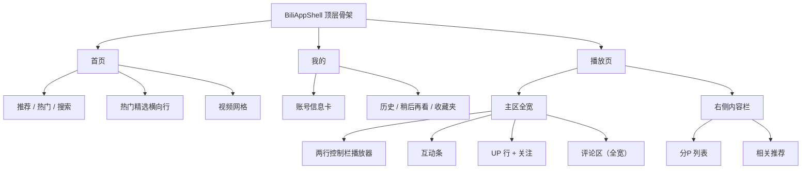

# Bilibili 插件页面布局与逻辑重设计

> 创建日期：2026-08-11
> 状态：Stage 1 设计已确认（经 grill-me 逐项确认），待进入实施
> 关联主设计：`docs/superpowers/specs/2026-08-10-bilibili-plugin-design.md`
> 关联 UI 设计：`docs/superpowers/specs/2026-08-11-bilibili-ui-redesign.md`
> 关联互动设计：`docs/superpowers/specs/2026-08-11-bilibili-interactions-design.md`
> 目标范围：只重设计官方 Bilibili 插件前端页面布局与页面逻辑；不改 Rust 后端、SDK 命令、播放代理、取流、账号能力与 `bpi-rs` 协议层。

## 1. 背景与目标

Bilibili 内置插件已经完成主链路（P0-P9）、UI 布局优化（首页/播放页/我的页三页结构、右侧 Tabs）、播放页互动增强（互动条、投币/收藏面板、关注 UP）。但用户实测反馈：**页面布局和页面逻辑不太好**，具体痛点在：

- **首页逻辑散乱**：推荐/热门/搜索三种模式各有一套 `page` 计数器（`recommendPage`/`popularPage`/`searchPage`），三个近乎复制的 `loadRecommend`/`loadPopular`/`search` 函数，共享一份 `videos`/`loading`/`error` 状态互相覆盖。切 Tab 数据被覆盖、刷新语义不清。
- **播放页右侧 Tabs 拥挤**：`分P / 清晰度 / 弹幕 / 评论 / 更多` 五个 Tab 挤在一个 ~320px 侧栏，评论这种重内容（列表+楼中楼+发布框+分页）塞进侧栏体验差。
- **清晰度/弹幕被误判为"低频控制"**：UI 重设计把清晰度、弹幕设置放进了侧栏 Tab，但它们是**播放器控制项**（B 站网页端在控制栏里），不是侧栏内容。
- **播放页状态与职责过重**：`WatchPage` 堆十几个 state + 一打交互回调（`toggleLike`/`coinVideo`/`favoriteVideo`/`toggleToView`/`toggleFollowOwner`/`shareVideo`...），`PlayerShell` 同时管播放器、分P、清晰度、弹幕设置、更多操作。
- **相关推荐死代码**：`bilibili_related_videos` command 与 `sdk.bilibili.video.related` 已实现，但前端从未接线。

本次重设计把插件的页面布局和页面逻辑整体重做：首页解决逻辑散乱并更有内容节奏，播放页回归"播放器为中心 + 评论全宽 + 侧栏只放内容"，我的页强化个人中心感，并把页面状态收敛到可读的自定义 Hook。

## 2. 已确认决策（grill-me 逐项确认）

| # | 决策点 | 结论 |
| --- | --- | --- |
| D1 | 交付边界 | **逻辑 + 布局一次到位，不碰信息架构**（不做独立视频详情页、不改插件内导航层级） |
| D2 | 首页 feed 逻辑模型 | **抽 `usePagedFeed` 自定义 Hook**，推荐/热门/搜索各一个独立实例，各自持有 `items/page/loading/error/query`，消灭三套计数器与三个复制 load 函数 |
| D3 | 搜索结果归属 | **搜索成为第三个 Tab**（推荐/热门/搜索），提交搜索自动切到"搜索"Tab；空搜索词显示"输入关键词开始搜索"引导空态 |
| D4 | 首页视觉 | **顶部"热门精选"横向滚动行 + 下方主网格**；热门行独立取热门 Top N，主网格用推荐；推荐 Tab = 推荐全量，热门 Tab = 热门全量。不做纯装饰 hero |
| D5 | 播放页布局 | **主区全宽 + 右侧内容栏**：评论区回主区全宽（播放器 → 弹幕输入 → 互动条 → UP 行 → 标题/统计/简介 → 评论区），推翻 UI 重设计"评论进 Tab"的决策 |
| D6 | 右侧栏定位 | 右侧栏**只放内容不放设置**，收窄 ~280px，放 `分P 列表 + 相关推荐`（把相关推荐死代码接上） |
| D7 | 清晰度/弹幕位置 | **进播放器控制栏**（点开 popover），不再放侧栏 Tab |
| D8 | 控制栏结构 | **两行控制栏**：第一行进度条 + 时间占满；第二行播放/暂停 | 音量 | 倍速 | 清晰度▾ | 弹幕▾ | 截图 | 全屏，**全部图标化** |
| D9 | 互动条 | 保持 `点赞/投币/收藏/分享/稍后再看/举报/更多` 七项不膨胀；截图移进控制栏 |
| D10 | "更多"菜单 | **外观像右键菜单的浮层**（竖排列表/图标/hover 高亮），**交互是普通 popover**（点击弹、点外/Esc 关）。不扩宿主 SDK，纯插件内样式。**投币/收藏/弹幕设置/更多统一成同一种弹层语言** |
| D11 | 我的页 | **顶部账号卡**（头像/昵称/UID + 能从现有 API 拼出的统计），下方保留历史/稍后再看/收藏夹三个 Tab；统计字段不设死，实现时翻 `bpi-rs`/`wiliwili` 能力，能拼出什么放什么 |
| D12 | 响应式 | 主场景宽窗口三栏结构成立；**最小窗口（720px，可用 ~650px）时侧栏收成可展开面板**，主链路（播放器+信息+评论）全宽不断，首页网格自动降列，控制栏两行不换行 |
| D13 | 工程结构 | 抽 `usePagedFeed` + `useVideoInteraction` 两个 Hook；**`runtime.ts` 全局 store 保留**（登录态/配置跨三页共享是它的正当职责，不为统一而统一） |

## 3. 当前实现审查

### 3.1 当前首页（`src/pages/HomePage.tsx` + `src/components/HomeFeed.tsx` + `HomeFeedTabs.tsx`）

```text
HomePage
  BiliAppShell current="home"
    bili-search (TextField + 搜索 + 刷新)
    HomeFeed
      HomeFeedTabs (推荐 / 热门)
      bili-video-grid (VideoCard 网格)
```

问题：

- 三套 page 计数器 + 三个 load 函数复制；`mode` 决定显示哪份数据。
- `HomeFeedTabs` 只有推荐/热门，搜索是"覆盖态"——提交后 Tab 高亮无归属。
- 刷新语义：`refreshCurrent()` 按 mode 分支，但每 mode 的 page 推进逻辑不一致。
- 首页第一屏是"搜索框 + 等大网格"，没有内容节奏。

### 3.2 当前播放页（`src/pages/WatchPage.tsx` + `src/components/PlayerShell.tsx` + `WatchSidebarTabs.tsx`）

```text
WatchPage
  BiliAppShell current="watch"
    PlayerShell
      bili-watch-grid
        bili-watch-main
          bili-player-shell (video + DanmakuOverlay + 单行控制栏 + 错误 overlay)
          DanmakuInput
          VideoInteractionBar (点赞/投币/收藏/分享/稍后再看/举报/更多)
          VideoOwnerRow (UP 行 + 关注)
          bili-video-detail-panel (标题/统计/简介)
        bili-watch-side (WatchSidebarTabs: 分P/清晰度/弹幕/评论/更多)
```

问题：

- 单行控制栏已挤（播放/暂停、进度条、时间、音量、倍速、全屏、截图）。
- 右侧 5 Tab 拥挤，评论重内容塞进 ~320px 侧栏。
- `PlayerShell` 同时承担分P 列表、清晰度面板、弹幕设置面板、更多操作面板，职责过重。
- 清晰度/弹幕设置放侧栏，违背"播放器控制项进控制栏"的直觉。
- `WatchSidebarTabs` 内 `defaultTab` 依赖 `detail.pages.length`（>1 才默认分P），且"更多"Tab 通过 `focusMoreNonce` 被互动条驱动，逻辑绕。

### 3.3 当前我的页（`src/pages/MinePage.tsx` + `AccountLibraryTabs.tsx`）

```text
MinePage
  BiliAppShell current="mine"
    LoginPanel
    AccountLibraryTabs (历史 / 稍后再看 / 收藏夹)
```

问题：

- 登录前后内容密度差异大；账号内容三个 Tab 全是视频卡片列表，缺少个人中心感。

### 3.4 数据流现状

插件有**两套状态体系并存**：

- `src/runtime.ts`：模块级全局 store（`state` + `setState` + `subscribe`），管登录态、配置、登录轮询。跨 首页/播放/我的 三页共享。
- 页面组件 React 本地 `useState`：管页面数据。

`runtime.ts` 的全局 store 有正当职责（登录态/配置跨页共享），本设计**保留不动**；只把页面级的散乱逻辑收敛进 Hook。

## 4. 目标页面结构



| 页面 | 路径 | 主要任务 |
| --- | --- | --- |
| 首页 | `home` | 浏览推荐/热门/搜索、看热门精选、进入播放页 |
| 播放 | `watch` | 播放、切 P、切清晰度、弹幕、互动、看评论与相关推荐 |
| 我的 | `mine` | 登录、账号卡、历史/稍后再看/收藏夹 |

## 5. 首页设计

### 5.1 桌面布局

```text
+----------------------------------------------------------+
| Bilibili        首页  我的        搜索框      刷新  头像 |
+----------------------------------------------------------+
| [推荐] [热门] [搜索]                                      |
|                                                          |
| 热门精选  [卡片][卡片][卡片][卡片]  (横向滚动)           |
|                                                          |
| [卡片][卡片][卡片][卡片]                                  |
| [卡片][卡片][卡片][卡片]    (主网格 4-5 列)               |
+----------------------------------------------------------+
```

### 5.2 逻辑模型：`usePagedFeed`

每个模式一个独立实例：

```ts
// 推荐：mount 即加载第一页
const recommend = usePagedFeed((page, refresh) => sdk.bilibili.home.recommendVideos(page, refresh), { key: "recommend" });
// 热门：懒加载（首次切到热门 Tab 才请求，对齐现有行为）
const [popularActive, setPopularActive] = useState(false);
const popular = usePagedFeed((page, refresh) => sdk.bilibili.home.popularVideos(page, refresh), { key: "popular", enabled: popularActive });
// 搜索：key 用"已提交关键词"，而非实时输入框，避免敲键即搜索
const [searchKeyword, setSearchKeyword] = useState("");
const search = usePagedFeed((page, refresh) => sdk.bilibili.home.searchVideos(searchKeyword, page, refresh), { key: searchKeyword, enabled: searchKeyword.length > 0 });
```

行为：

- 三个模式各自持有 `items / page / loading / error`，切 Tab 不丢各自数据。
- `reload()` = 换一批（page+1 + 绕过缓存），刷新只刷当前模式。
- 搜索提交设置 `searchKeyword`：新词经 `key` 变化自动重置到第一页；同词重提交调用 `reset()` 重载第一页。
- 空关键词不进入搜索空态。

### 5.3 首页行为

- 默认加载"推荐"。
- 搜索提交 → 自动切到"搜索"Tab 显示结果；空关键词 → 回到当前 Tab（推荐或热门），不进入搜索空态。
- "搜索"Tab 未输入关键词时显示"输入关键词开始搜索"引导空态。
- 顶部"热门精选"横向滚动行独立取 `popularVideos` 前 N 个，下方主网格为当前 mode 数据。
  - 热门行**始终显示**在 feed Tab 下方、主网格上方（含搜索模式，对齐 §5.1 静态布局）；由 HomeFeed 组合渲染，独立取数，加载失败只隐藏该行，不阻塞主网格。
- 刷新只刷新当前模式。

### 5.4 视频卡片

保留现有 `VideoCard` 有效能力：`BiliImage` 封面代理、16:9、标题两行截断、UP/播放量/弹幕数/时长/历史进度紧凑展示、hover 轻量缩放。

## 6. 播放页设计

### 6.1 桌面布局

```text
+----------------------------------------------------------+
| Bilibili        首页  我的                    返回  头像 |
+----------------------------------------------------------+
| +-----------------------------------------------+ +-----+ |
| |  播放器（video + 弹幕 overlay）                | | 分P  | |
| |  第一行: 进度条 + 时间                         | |      | |
| |  第二行: 播放 | 音量 | 倍速 | 清晰度▾ |        | | 相关 | |
| |          弹幕▾ | 截图 | 全屏                   | | 推荐 | |
| +-----------------------------------------------+ +-----+ |
| | 弹幕输入条                                       |       |
| | 互动条: 点赞投币收藏分享稍后再看举报[更多▾]       |       |
| | UP 行: 头像 昵称 粉丝 [关注]                     |       |
| | 标题 / 统计 / 简介                                |       |
| | 评论区（全宽）                                   |       |
| +-----------------------------------------------+       |
+----------------------------------------------------------+
```

### 6.2 主区

主区自上而下全宽：

1. **播放器**：video + 弹幕 overlay + 两行控制栏。
2. **弹幕输入条**。
3. **互动条**：点赞/投币/收藏/分享/稍后再看/举报/更多 七项（截图已移入控制栏）。
4. **UP 信息行**：头像/昵称/粉丝 + 关注按钮。
5. **标题 / 统计 / 简介**。
6. **评论区全宽**：排序切换、发布框、列表、楼中楼、分页。

### 6.3 两行控制栏

| 行 | 控件 |
| --- | --- |
| 第一行 | 进度条（占满）+ 当前时间/总时长 |
| 第二行 | 播放/暂停 | 音量/静音 | 倍速（图标+数值） | 清晰度▾（popover） | 弹幕▾（popover） | 截图 | 全屏 |

全部图标化；倍速、清晰度、弹幕状态需要文字时用"图标 + 小标签"。

- **清晰度 popover**：复用 `QualityMenu`（自动/手动/具体清晰度），从播放器实际状态取。
- **弹幕 popover**：开关 + 字号/透明度/密度/速度滑块（从 `PlayerShell` 内现有的弹幕设置面板迁移）。

### 6.4 右侧内容栏（~280px）

| 区块 | 内容 |
| --- | --- |
| 分P | 分 P 列表、当前播放项、时长（复用现有 `bili-page-list`） |
| 相关推荐 | 新增 `RelatedPanel`，接线 `sdk.bilibili.video.related`，复用 `VideoCard` |

侧栏**不放任何播放器设置**。

### 6.5 弹层统一

投币面板、收藏面板、弹幕设置、更多菜单统一为**右键菜单样式的浮层**（竖排列表/图标/hover 高亮/点外关闭），交互仍是普通 popover。宿主 SDK 不扩，插件内样式实现。

## 7. 我的页设计

### 7.1 布局

```text
+----------------------------------------------------------+
| Bilibili        首页  我的        搜索按钮        头像   |
+----------------------------------------------------------+
| 账号信息卡（头像 / 昵称 / UID / 统计）                    |
|----------------------------------------------------------|
| [历史] [稍后再看] [收藏夹]                                 |
| 当前 Tab 内容                                            |
+----------------------------------------------------------+
```

### 7.2 账号信息卡

- 未登录：登录卡片（二维码生成/轮询/取消/过期）。
- 已登录：头像、昵称、UID + 从现有 API 能拼出的统计（如历史条数、稍后再看条数、收藏夹数）。
- 统计字段不设死：实施时调查 `bpi-rs` 与 `wiliwili` 现有能力，能拼出什么放什么，拼不出的不硬造、不空卡。

### 7.3 账号内容

保留历史/稍后再看/收藏夹三个 Tab，复用 `VideoCard`；收藏夹左侧 folder 列表 + 右侧资源列表不变。

## 8. 逻辑层重构

### 8.1 `usePagedFeed`

自定义 Hook，封装分页加载状态机，供首页三种模式复用。接口目标：

```ts
interface UsePagedFeedOptions {
  key?: string | number;   // 变化时自动 reset 到第一页并加载
  enabled?: boolean;       // false 时不加载（如空关键词搜索）；翻 true 时加载第一页
}

interface UsePagedFeedResult<T> {
  items: T[];
  page: number;
  loading: boolean;
  error: string;
  reload(): void;   // 换一批：page+1 并绕过缓存（对齐当前"刷新"语义）
  reset(): void;    // 重新加载第一页（同词重提交场景）
}
```

实现要点：

- 内部管理 `page`、`loading`、`error`、`items`。
- 接收"取数函数"（签名 `(page, refresh) => Promise<T[]>`）与 `key` 标识，`key` 变化自动 reset 到第一页并加载。
- `enabled` 为 false 时不加载并清空数据（首页搜索空关键词场景）。
- `reload()` 语义为**换一批**（page+1 + refresh=true），对齐现有"刷新"行为，不是刷新当前页。
- 不实现 `loadMore()`：首页当前无"加载更多"UI，`reload()` 已覆盖翻批需求，避免死代码。
- 避免已卸载后 setState（沿用现有 `active` 守卫模式，并用请求序号丢弃过期响应）。
- `refresh` 透传给后端（命中现有缓存绕过）。

### 8.2 `useVideoInteraction`

封装播放页互动状态与操作，收敛 `WatchPage` 的散乱回调：

```ts
interface UseVideoInteractionResult {
  state: BiliVideoInteractionState | null;
  loading: boolean;
  error: string;
  busy: string;                 // 当前进行中的操作名，串行锁
  like(): void;                 // 乐观 + 回滚
  coin(multiply, alsoLike): void;   // 非乐观
  favorite(addMediaIds, delMediaIds): void;
  toggleToView(): void;         // 乐观 + 回滚
  followOwner(): void;          // 乐观 + 回滚
  share(): Promise<void>;
  report(): void;
  refresh(): Promise<void>;
}
```

实现要点：

- 接收 deps：`{ aid, bvid, ownerMid, loggedIn }`；`aid/bvid/ownerMid` 变化（切换视频）与 `loggedIn` 变化（登录态）时重新加载互动状态，对齐现有 effect 行为。
- 内部持有 `state/loading/error/busy`。
- 乐观更新 + 失败回滚逻辑（点赞/稍后再看/关注）从 `WatchPage` 移入。
- 投币不做乐观更新，成功后以服务端状态刷新。
- 写操作前登录门控：未登录提示"请先登录 Bilibili"；互动状态未加载完成提示"互动状态还在加载"。
- 互动加载失败不阻塞播放。

### 8.3 `runtime.ts` 保留

全局 store（登录态/配置/登录轮询）保持原样，本设计不迁移到 React Context。

## 9. 响应式设计

主窗口 `minWidth: 720px`，插件页面实际可用约 650px。

| 场景 | 行为 |
| --- | --- |
| 宽窗口（主场景） | 播放页主区全宽 + 右侧内容栏常驻；首页 4-5 列网格 |
| 最小窗口（~720px） | 右侧内容栏收成可展开面板（点开覆盖或下拉），不常驻占宽；主链路（播放器+信息+评论）全宽不断；首页网格自动降 2-3 列；控制栏两行不换行（图标化省空间） |

## 10. 组件拆分

新增：

```text
src/hooks/usePagedFeed.ts
src/hooks/useVideoInteraction.ts
src/components/HotRow.tsx            // 首页热门精选横向行
src/components/RelatedPanel.tsx      // 播放页相关推荐（接线 video.related）
src/components/WatchMoreMenu.tsx     // 更多菜单（右键菜单样式浮层）
src/components/DanmakuSettingsPopover.tsx  // 弹幕设置 popover（自 PlayerShell 迁出）
src/components/AccountCard.tsx       // 我的页账号信息卡
```

调整：

- `HomeFeed.tsx` / `HomeFeedTabs.tsx`：改为纯展示组件，接收三实例数据；`HomeFeedTabs` 增加"搜索"Tab。
- `PlayerShell.tsx`：移除分P/清晰度面板/弹幕设置面板/更多面板容器；控制栏改两行 + 图标化；清晰度/弹幕改 popover；截图入控制栏。
- `WatchSidebarTabs.tsx`：改为右侧内容栏（分P + 相关推荐），不再承载设置 Tab。
- `CoinPanel.tsx` / `FavoritePanel.tsx` / 弹幕设置：统一为菜单样式浮层。
- `VideoInteractionBar.tsx`：保持七项，`更多` 改为弹菜单。
- `CommentPanel.tsx`：从侧栏 Tab 移入主区全宽。
- `MinePage.tsx` / `AccountLibraryTabs.tsx`：接入账号卡。

保留复用：`VideoCard`、`BiliImage`、`LoginPanel`、`QualityMenu`（作为 popover 内容）、`DanmakuInput`、`DanmakuOverlay`、`ScreenshotButton`、`VideoOwnerRow`。

## 11. 样式原则

- 延续 UI 重设计已确认的原则：`--bili-accent: #fb7299` 只作主强调色，`--bili-cyan: #23ade5`，背景用 EasyGameHub `--card/--border/--foreground/--muted-foreground`，卡片圆角 ≤ 8px，不做大面积粉色、不做卡片套卡片。
- 弹层统一为菜单样式（竖排、图标 + 文字、hover 高亮、danger 项支持、点外/Esc 关闭）。
- 控制栏图标化，倍速/清晰度/弹幕状态用"图标 + 小标签"。
- loading/empty/error/disabled 状态统一。

## 12. 非目标

- 不改 `src-tauri/src/core/bilibili`、`src-tauri/src/commands/bilibili.rs`。
- 不改 `src/plugins/sdk.ts` 的 SDK 方法签名（除确需新增的菜单/弹层能力——本设计不扩宿主 SDK）。
- 不改播放代理、MPD 生成、DASH/MP4 fallback、进度 reporter、弹幕读取/发送、评论 API、收藏/稍后再看 API。
- 不做独立视频详情页、不改插件内导航层级（`home/mine/watch` 三页结构不变）。
- 不新增下载、离线缓存、番剧、直播、动态等能力。
- 不把 `runtime.ts` 全局 store 迁移到 React Context。

## 13. 风险与应对

| 风险 | 应对 |
| --- | --- |
| 播放页布局重构回退播放能力 | 每阶段保留播放核心（dash/fallback/progress）不动，布局改动只动 JSX 与样式 |
| 弹层统一改样破坏投币/收藏交互 | 弹层只改视觉不改行为，投币/收藏确认流程保持 |
| 相关推荐接口不稳定 | 相关推荐面板独立加载，失败只显示空态，不阻塞播放页 |
| 我的页统计字段拿不到数据 | 实施时先调查 `bpi-rs`/`wiliwili` 能力，能拼出什么放什么，不做空卡 |
| `usePagedFeed`/`useVideoInteraction` 重构引入回归 | 先抽 Hook 保留原行为，再改布局；每阶段跑插件构建 |
| 首页三 Tab 后搜索空态语义不清 | "搜索"Tab 空态明确引导；空关键词不进入搜索空态 |

## 14. 验收标准

- 首页不再有三套 page 计数器；推荐/热门/搜索各实例数据独立，切 Tab 不互相覆盖。
- 刷新只刷新当前模式。
- 搜索成为第三 Tab，空关键词不进入搜索空态。
- 首页有"热门精选"横向行 + 主网格，有内容节奏。
- 播放页评论区在主区全宽，不再塞进侧栏。
- 右侧内容栏只放分P + 相关推荐；相关推荐已接线 `video.related` 并有数据。
- 清晰度/弹幕在控制栏 popover 中，不在侧栏。
- 控制栏两行、图标化，播放/暂停、音量、倍速、清晰度、弹幕、截图、全屏齐全。
- 投币/收藏/弹幕设置/更多弹层统一为菜单样式浮层。
- 我的页有账号卡（头像/昵称/UID + 可拼统计）。
- 最小窗口下侧栏收成可展开面板，主链路全宽不断。
- 播放能力不回退：DASH 高清、兼容 MP4、清晰度切换、弹幕、评论、互动、进度、截图、收藏、稍后再看保持可用。
- 插件 `npm run build` 与 `npm run pack` 通过，并同步 `plugins/` 与 `resources/defaults/plugins/`。
