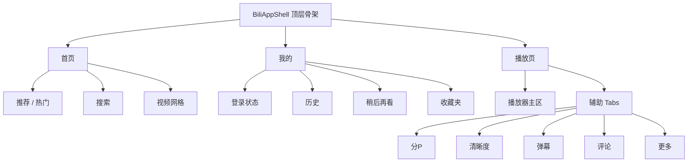

# Bilibili 插件 UI 布局优化设计文档

> 创建日期：2026-08-11  
> 状态：Stage 1 设计已确认，待进入实施  
> 关联主设计：`docs/superpowers/specs/2026-08-10-bilibili-plugin-design.md`  
> 关联主计划：`docs/superpowers/plans/2026-08-10-bilibili-plugin-plan.md`  
> 目标范围：仅优化官方 Bilibili 插件前端 UI 信息架构、页面布局、组件拆分和响应式，不改播放核心、SDK 命令、Rust 后端、代理、取流和账号能力。

## 1. 背景

Bilibili 内置插件已经完成 P0-P9 主链路：登录、首页推荐/热门/搜索、视频详情、DASH/兼容播放、清晰度切换、进度同步、截图、弹幕、历史、稍后再看、收藏夹、评论、缓存、设置区和内置分发。

当前 UI 的主要问题不是能力缺失，而是信息组织仍偏“功能面板堆叠”：

- 首页同时常驻搜索、推荐/热门、视频列表、登录面板、历史、稍后再看、收藏夹，第一屏重心不够像视频客户端。
- 播放页同时暴露播放器、弹幕输入、详情、分 P、清晰度、弹幕设置、截图、外部打开、账号操作、评论区，用户感知上是从上到下堆功能。
- 账号内容和播放辅助控制没有明确层级，导致首页和播放页都显得简陋、拥挤。

本次设计把插件定位从“插件控制台”调整为“内置 Bilibili 视频客户端”：首页负责找视频，播放页负责看视频，我的页负责账号内容。

## 2. 已确认决策

### 2.1 产品定位

插件应设计成内容消费客户端，布局和交互参考 `wiliwili` / Bilibili 客户端习惯，而不是 EasyGameHub 风格的工具管理面板。

### 2.2 首页第一屏

首页第一屏只服务“找视频/看视频”：

- 顶部搜索。
- `推荐` / `热门` 主 Tab。
- 视频网格。
- 右上角头像、登录或账号入口。

历史、收藏、稍后再看等账号内容不再常驻首页侧栏，统一进入 `我的` 视图。

### 2.3 播放页结构

播放页使用“播放器主区 + 单任务辅助 Tabs”：

- 主区：播放器、播放器内高频控制、弹幕输入、视频基础信息。
- 右侧 Tabs：`分P`、`清晰度`、`弹幕`、`评论`、`更多`。
- 任一时刻只展开一个辅助面板。

评论默认进入播放页辅助 Tabs，不再常驻播放器下方。

### 2.4 账号区

新增或整理为独立 `我的` 视图，集中展示：

- 登录状态、头像、昵称、UID。
- 历史记录。
- 稍后再看。
- 收藏夹。
- 账号操作。

首页只保留头像/登录入口。

### 2.5 插件内导航

插件内部新增轻量顶栏导航：

- 左侧：Bilibili 标识。
- 中间：`首页`、`我的`。
- 右侧：搜索入口、刷新、头像/登录。

播放页保留顶栏，但内容区切换为沉浸播放器布局，并提供返回首页或上一级入口。

### 2.6 视觉方向

视觉融合方向：

- 布局和交互靠近 wiliwili / Bilibili 客户端。
- Bilibili 粉 `#fb7299` 只作为主强调色。
- 继续兼容 EasyGameHub 的主题变量、玻璃背景和 8px 左右圆角。
- 不做大面积粉色，不做卡片套卡片，不做营销 hero。
- 页面整体应像视频客户端，不像管理后台。

## 3. 当前 UI 结构审查

### 3.1 当前首页

当前文件：

- `scripts/official-plugins/bilibili/src/pages/HomePage.tsx`
- `scripts/official-plugins/bilibili/src/components/LoginPanel.tsx`
- `scripts/official-plugins/bilibili/src/components/AccountLibraryTabs.tsx`
- `scripts/official-plugins/bilibili/src/components/VideoCard.tsx`

当前结构：

```text
HomePage
  bili-shell
    bili-home
      bili-home-header
      bili-home-grid
        bili-main-column
          search
          content-panel
            recommend/popular/search
            video-grid
        bili-side-column
          LoginPanel
          AccountLibraryTabs
```

问题：

- `LoginPanel` 和 `AccountLibraryTabs` 作为首页常驻侧栏，占用第一屏注意力。
- 首页的“推荐/热门/搜索”和账号库是两个不同任务，却在同一屏并列。
- 搜索框和刷新按钮是工具式布局，没有形成客户端顶栏。

### 3.2 当前播放页

当前文件：

- `scripts/official-plugins/bilibili/src/pages/WatchPage.tsx`
- `scripts/official-plugins/bilibili/src/components/PlayerShell.tsx`
- `scripts/official-plugins/bilibili/src/components/QualityMenu.tsx`
- `scripts/official-plugins/bilibili/src/components/DanmakuInput.tsx`
- `scripts/official-plugins/bilibili/src/components/CommentPanel.tsx`

当前结构：

```text
WatchPage
  header
  PlayerShell
    watch-grid
      watch-main
        player
        DanmakuInput
        video-detail-panel
      watch-side
        panel: 分 P
        panel: 清晰度 + 弹幕设置 + 外部打开 + 截图目录 + 账号操作
  CommentPanel
```

问题：

- 播放辅助功能仍同时暴露，用户需要在多个纵向面板里找功能。
- 评论独立堆在播放页下方，破坏“播放器优先”。
- `PlayerShell` 同时承担播放器、分 P、清晰度、弹幕设置、账号操作和外部动作，组件责任过重。
- 小屏只把两列改一列，仍然是纵向堆叠，不是播放任务优先的响应式。

## 4. 目标信息架构



### 4.1 顶层页面

| 页面 | 路径 | 主要任务 |
| --- | --- | --- |
| 首页 | `home` | 浏览推荐/热门、搜索视频、进入播放页 |
| 播放 | `watch` | 播放当前视频、切 P、切清晰度、看评论、发弹幕 |
| 我的 | `mine` | 登录、历史、稍后再看、收藏夹、账号操作 |

### 4.2 页面责任边界

首页不负责账号内容浏览；播放页不负责账号库浏览；我的页不负责播放控制。

例外：

- 播放页 `更多` Tab 可以保留当前视频的收藏、稍后再看、截图、外部打开。
- 首页顶栏头像可以触发登录或跳转到 `我的`。
- 我的页点击历史/收藏/稍后再看视频后进入播放页。

## 5. 首页设计

### 5.1 桌面布局

```text
+----------------------------------------------------------+
| Bilibili        首页  我的        搜索框      刷新  头像 |
+----------------------------------------------------------+
| 推荐 | 热门                                               |
|                                                          |
| [视频卡] [视频卡] [视频卡] [视频卡]                     |
| [视频卡] [视频卡] [视频卡] [视频卡]                     |
| [视频卡] [视频卡] [视频卡] [视频卡]                     |
+----------------------------------------------------------+
```

### 5.2 首页行为

- 默认加载 `推荐`。
- `推荐` / `热门` 是并列 Tab，不是二选一入口。
- 搜索提交后，列表进入搜索结果状态，但主导航仍留在首页。
- 刷新只刷新当前模式：
  - 推荐：换一批推荐。
  - 热门：刷新热门页。
  - 搜索：刷新当前关键词结果。
- 视频卡点击进入 `watch`。
- 未登录时不在首页展开二维码，头像区域显示登录入口，点击进入 `我的` 后扫码。

### 5.3 视频卡片

视频卡片应保留当前已经有效的能力：

- 使用 `BiliImage` / 本地封面代理，避免 B 站图片 403。
- 16:9 封面。
- 标题最多 2 行。
- UP、播放量、弹幕数、时长、历史进度紧凑展示。
- hover 只做轻量封面缩放或边框强调。

## 6. 播放页设计

### 6.1 桌面布局

```text
+----------------------------------------------------------+
| Bilibili        首页  我的                    返回  头像 |
+----------------------------------------------------------+
| +--------------------------------------+ +-------------+ |
| |                                      | | 分P 清晰度  | |
| |              播放器                  | | 弹幕 评论  | |
| |                                      | | 更多        | |
| |        高频控制条                    | |-------------| |
| +--------------------------------------+ | 当前 Tab     | |
| | 弹幕输入条                            | | 内容        | |
| | 标题 / UP / 播放量 / 简介             | |             | |
| +--------------------------------------+ +-------------+ |
+----------------------------------------------------------+
```

### 6.2 主区

播放器内保留高频控制：

- 播放/暂停。
- 进度条。
- 当前时间/总时长。
- 音量/静音。
- 倍速。
- 全屏。
- 当前清晰度入口或简短状态。

播放器下方：

- 弹幕输入条。
- 视频标题、UP、统计、简介。

### 6.3 右侧 Tabs

| Tab | 内容 |
| --- | --- |
| 分P | 分 P 列表、当前播放项、时长 |
| 清晰度 | 高清/兼容模式、自动/手动清晰度、当前实际清晰度 |
| 弹幕 | 开关、字号、透明度、密度、速度、加载错误 |
| 评论 | 评论排序、发布框、评论列表、楼中楼、分页 |
| 更多 | 外部打开、截图、截图目录、稍后再看、收藏夹 |

### 6.4 小屏响应式

窄窗口下不使用遮挡播放器的抽屉，改为播放器下方横向 Tabs：

```text
播放器
弹幕输入条
标题信息
[分P] [清晰度] [弹幕] [评论] [更多]
当前 Tab 内容
```

原则：

- 播放器永远在最上方。
- 当前 Tab 内容只展开一个。
- 评论在当前 Tab 内滚动或分页加载。
- 不把所有控制重新堆回页面。

## 7. 我的页设计

### 7.1 布局

```text
+----------------------------------------------------------+
| Bilibili        首页  我的        搜索按钮        头像   |
+----------------------------------------------------------+
| 账号信息 / 登录状态                                      |
|----------------------------------------------------------|
| 历史 | 稍后再看 | 收藏夹                                  |
|                                                          |
| 当前 Tab 内容                                            |
+----------------------------------------------------------+
```

### 7.2 登录态

未登录：

- 显示登录卡片。
- 二维码生成、轮询、取消、过期提示。
- 不显示账号库假入口。

已登录：

- 显示头像、昵称、UID。
- 提供退出登录。
- 展示账号内容 Tabs。

### 7.3 账号内容

- 历史：复用视频卡或紧凑列表，显示进度。
- 稍后再看：复用视频卡。
- 收藏夹：左侧收藏夹列表，右侧视频资源列表；小屏上下排列。

## 8. 组件拆分

新增或调整组件建议：

```text
src/pages/
  MinePage.tsx

src/components/
  BiliAppShell.tsx
  BiliTopNav.tsx
  HomeFeed.tsx
  HomeFeedTabs.tsx
  MineLibraryTabs.tsx
  WatchLayout.tsx
  WatchSidebarTabs.tsx
  WatchPagesPanel.tsx
  WatchQualityPanel.tsx
  WatchDanmakuPanel.tsx
  WatchMorePanel.tsx
```

保留并复用：

- `VideoCard`
- `BiliImage`
- `LoginPanel`
- `AccountLibraryTabs`，可重命名或收敛为 `MineLibraryTabs`
- `PlayerShell` 的播放器内核部分
- `QualityMenu`
- `DanmakuInput`
- `DanmakuOverlay`
- `CommentPanel`
- `ScreenshotButton`

### 8.1 `PlayerShell` 职责收缩

`PlayerShell` 继续负责播放内核：

- video element。
- dash player 生命周期。
- progress reporter。
- keyboard。
- overlay。
- 高频播放器控制。

从 `PlayerShell` 移出：

- 分 P 列表渲染。
- 清晰度面板容器。
- 弹幕设置面板。
- 账号操作区。
- 截图目录、外部打开等低频动作面板。

这些能力移动到 `WatchSidebarTabs` 对应 panels。

### 8.2 状态归属

`WatchPage` 保持播放相关状态源：

- `detail`
- `selectedPage`
- `playback`
- `playbackMode`
- `danmakuSettings`
- `danmakuItems`
- `syncProgress`
- `defaultPlaybackRate`
- 登录态快照

`WatchSidebarTabs` 只负责展示和触发回调，不重新创建播放会话。

## 9. 样式原则

- 卡片圆角最大保持 8px，评论头像等自然圆形例外。
- 不做卡片套卡片；页面区域用布局容器，单个视频、评论、收藏夹项才使用卡片。
- 主色使用：
  - `--bili-accent: #fb7299`
  - `--bili-cyan: #23ade5`
- 背景继续使用 EasyGameHub 的 `--card`、`--border`、`--foreground`、`--muted-foreground`。
- 不使用大面积单色粉色背景。
- 按钮、Tab、输入框都要有 loading、disabled、error、empty 状态。
- 文本不得溢出按钮或卡片；长标题二行截断，长错误 `overflow-wrap: anywhere`。

## 10. 非目标

本次 UI 优化不做：

- 不改 `src-tauri/src/core/bilibili`。
- 不改 Bilibili SDK 方法签名。
- 不改播放代理、MPD 生成、DASH/MP4 兼容 fallback。
- 不重新解决黑屏、清晰度、403 图片代理等已修复问题。
- 不新增下载、离线缓存、番剧、直播、动态等能力。
- 不把评论或账号写操作扩展到主设计以外。

## 11. 验收标准

- 首页第一屏不再常驻账号库面板。
- 首页有清晰的 `推荐` / `热门` Tab，搜索和刷新语义明确。
- 新增 `我的` 页面，登录、历史、稍后再看、收藏夹集中展示。
- 播放页播放器是视觉主角，右侧只显示一个当前辅助 Tab。
- 评论默认在播放页 `评论` Tab 中，不再常驻堆在播放器下方。
- 分 P、清晰度、弹幕设置、更多操作分别进入对应 Tab。
- 小屏下辅助 Tabs 移到播放器下方，仍只展开一个面板。
- 播放能力不回退：DASH 高清、兼容 MP4、清晰度切换、弹幕、评论、进度、截图、收藏、稍后再看保持可用。
- 插件构建和 pack 通过，并同步到开发期插件目录和默认资源目录。
